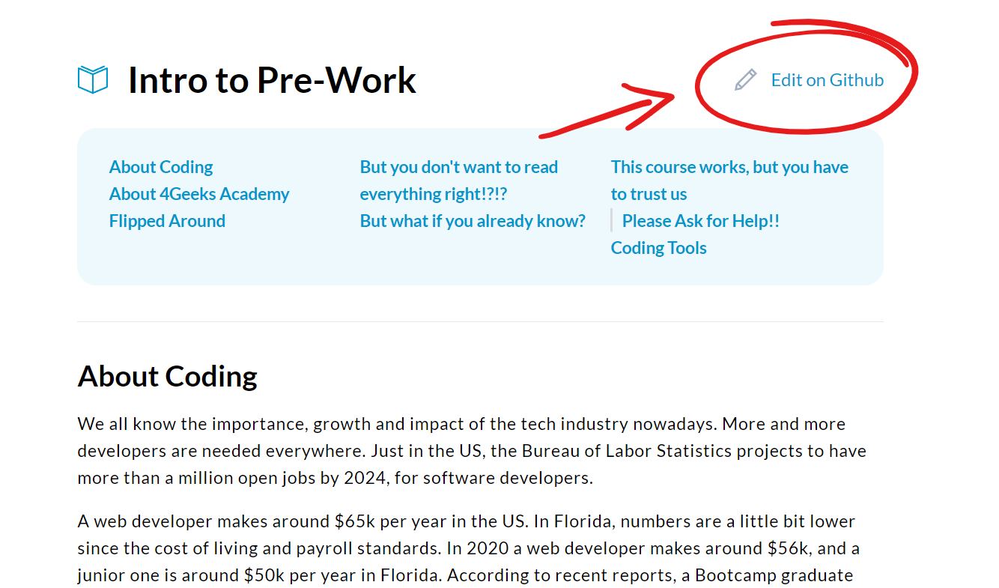

<!-- hide -->
# The Misspell Challenge
<!-- endhide -->
Learning in public means collaboration, and you don't have to be an expert to collaborate. Misspells come to the rescue!.

The perfect ice-breaker for open-source contributions; fixing a misspell is easy and requires almost no GitHub or git expertise.

## 📝 Instructions

Find one misspell on the any of the lessons, projects or exercises and create a pull request with the fix.

> Important: Please find another project to fix, this project has already been fixed enough 😂

1.1. Click the pencil icon that says "Edit on Github" at the top right of the lesson, and the lesson source file will be editable. 

1.2. Correct the misspelling of the lesson.

1.3. Finally, click on "Pull Request".
